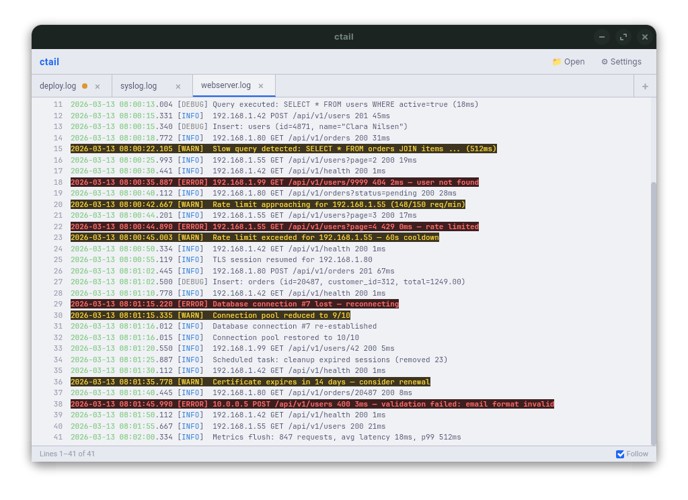
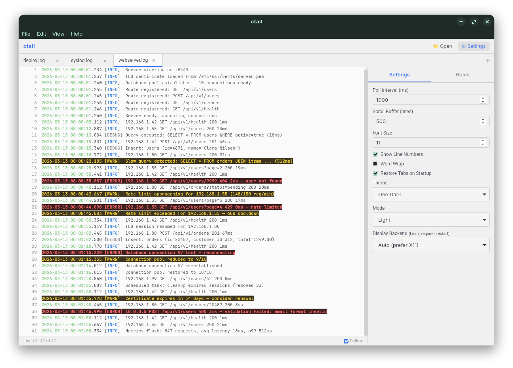
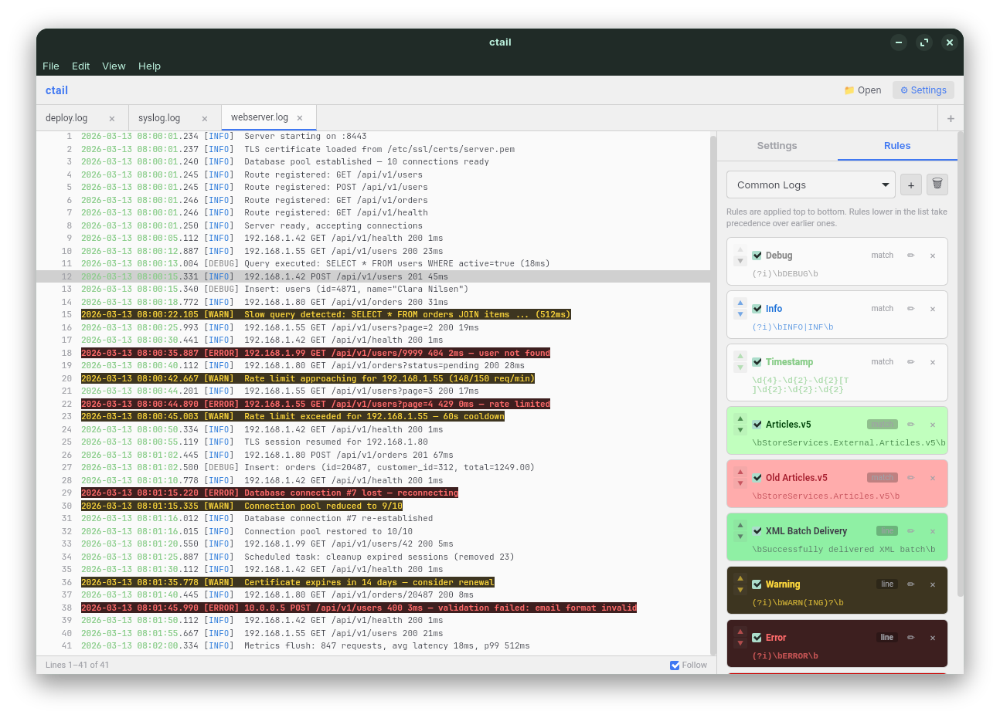

# ctail — Cross-Platform Log Tail Viewer with Highlighting

**ctail** — short for **color tail** — is a desktop log file viewer built with [Wails v2](https://wails.io/) (Go backend + Svelte frontend). Think `tail -f`, but with regex-powered color highlighting, multiple tabs, and a full GUI. Inspired by BareTail. Supports Windows, Linux, and macOS.

📖 **[User Manual](docs/user-manual.md)** — Full documentation on features, settings, and usage.

## Screenshots

| Dark Theme | Light Theme |
|:---:|:---:|
|  |  |

| Settings Panel | Rules Editor |
|:---:|:---:|
|  |  |

## Features

- **Multi-tab interface** — Open multiple log files simultaneously with keyboard navigation (Ctrl+Tab / Ctrl+Shift+Tab)
- **Tab drag-and-drop** — Reorder tabs by dragging them to new positions
- **Tab toggle** — Quick Ctrl+Tab toggles between the two most recent tabs
- **Real-time tailing** — Follow mode streams new lines as they're written, with automatic enable/disable on scroll
- **Regex-based highlighting** — Rules with foreground/background colors, bold/italic, line-level or match-level matching
- **Sliding window buffer** — Memory-bounded scrolling through large files; only a configurable window of lines (default 500) is kept in memory
- **Profile system** — Multiple highlighting profiles with visual rule preview and drag-and-drop reordering
- **AI assistant** — Ask AI about your logs or auto-generate highlighting rule profiles. Supports [GitHub Copilot, GitHub Models, OpenAI, and any OpenAI-compatible server](docs/ai-assistant.md) (Ollama, LM Studio, etc.)
- **Non-blocking I/O** — Files on slow or unreachable network mounts (NFS, CIFS/SMB, SSHFS) won't freeze the UI; all file operations run in the background with timeouts
- **Session persistence** — Window position/size, open tabs, active profile, and all settings survive restarts
- **Recent files** — Quick access to recently opened files from the File menu
- **Native menu bar** — File, Edit, View, Tools, and Help menus with standard keyboard accelerators
- **Context menus** — Right-click tabs for close/close others, right-click logs for copy/select/AI assist
- **Search** — Ctrl+F to filter lines within the buffer
- **Check for updates** — Manual update check from the Help menu
- **Themes** — 21 built-in color themes (Catppuccin, Nord, Tokyo Night, Gruvbox, Dracula, One Dark, Solarized, Everforest, Ayu, Kanagawa, Matrix, Rosé Pine, Monokai, and more), each with dark and light modes. Supports [custom themes](docs/custom-themes.md) via JSON files.
- **Cross-platform** — Linux, Windows, and macOS

## Quick Start

### Prerequisites

- Go 1.21+
- Node.js 18+
- [Wails CLI v2](https://wails.io/docs/gettingstarted/installation)
- **Linux**: `libgtk-3-dev`, `libwebkit2gtk-4.1-dev` (Ubuntu 24.04+) or `libwebkit2gtk-4.0-dev`
- **Windows**: WebView2 (included in Windows 10/11)

### Build & Run

```bash
# Install Wails CLI
go install github.com/wailsapp/wails/v2/cmd/wails@latest

# Run in dev mode (hot reload)
make dev

# Build for production
make build

# Run tests
make test
```

> **Note:** On Ubuntu 24.04+ / Zorin OS 18, the `webkit2_41` build tag is required (handled automatically by the Makefile). Override with `make dev TAGS=` on systems with webkit2gtk-4.0.

### Install (Linux)

After building, install system-wide with desktop integration:

```bash
make build
sudo make install
```

This installs the binary to `/usr/local/bin/`, a `.desktop` file for application launchers, and icons at all standard sizes. Uninstall with `sudo make uninstall`.

### Linux Packages (deb/rpm)

Build `.deb` or `.rpm` packages with proper dependencies (`libgtk-3-0`, `libwebkit2gtk-4.1-0`):

```bash
# Requires nfpm: go install github.com/goreleaser/nfpm/v2/cmd/nfpm@latest
make package-deb    # → build/ctail_0.4.0_amd64.deb
make package-rpm    # → build/ctail-0.4.0-1.x86_64.rpm

# Install
sudo dpkg -i build/ctail_0.4.0_amd64.deb   # Debian/Ubuntu
sudo rpm -i build/ctail-0.4.0-1.x86_64.rpm  # Fedora/RHEL
```

## Architecture

```
Go Backend                          Svelte Frontend
┌──────────────┐                    ┌──────────────────┐
│ File Tailer  │ ──Wails Events──▶  │ Tab Bar          │
│ (polling,    │                    │ Log View (scroll)│
│  offset idx) │                    │ Highlighted Lines│
├──────────────┤                    ├──────────────────┤
│ Config Mgr   │ ◀──Wails Bind──▶  │ Settings Panel   │
│ (JSON files) │                    │ Rule Editor      │
├──────────────┤                    ├──────────────────┤
│ Rule Engine  │                    │ Highlight Utils  │
│ (regex)      │                    │ (client-side)    │
├──────────────┤                    ├──────────────────┤
│ AI Client    │ ◀──Wails Bind──▶  │ AI Dialog        │
│ (multi-      │                    │ (chat, rules gen)│
│  provider)   │                    │                  │
└──────────────┘                    └──────────────────┘
```

- **Go backend** handles file I/O (polling + direct seek via byte offset index), configuration persistence, the rules engine, and AI provider communication
- **Svelte frontend** handles rendering, client-side highlighting (for instant rule feedback), scroll buffer management, and the AI assistant dialog
- **Communication** via Wails bindings (sync method calls) and events (async streaming)
- **No external Go dependencies** beyond Wails itself

## Menu Bar

| Menu | Items |
|------|-------|
| **File** | Open (Ctrl+O), Open Recent ▸, Close Tab (Ctrl+W), Quit (Ctrl+Q) |
| **Edit** | Copy (Ctrl+C), Select All (Ctrl+A), Find (Ctrl+F) |
| **View** | Settings (Ctrl+,), Toggle Theme |
| **Tools** | AI Assistant... (Ctrl+Shift+A) |
| **Help** | Check for Updates, About ctail |

## Themes

ctail ships with **21 built-in color themes**, each with dark and light modes:

| Theme | Description |
|-------|-------------|
| Catppuccin | Soothing pastel theme (default) |
| Catppuccin Frappé | Catppuccin mid-tone variant |
| Catppuccin Macchiato | Catppuccin warm variant |
| Nord | Arctic, north-bluish palette |
| Tokyo Night | Inspired by Tokyo city lights |
| Gruvbox | Retro groove colors |
| Dracula | Dark theme for vampires |
| One Dark | Atom editor's signature theme |
| Solarized | Precision colors by Ethan Schoonover |
| Everforest | Comfortable green forest palette |
| Ayu | Simple, bright colors |
| Kanagawa | Inspired by Katsushika Hokusai's art |
| Matrix | Hacker-style green on black |
| Rosé Pine | All natural pine, faux fur, and a bit of soho vibes |
| Monokai | Classic Sublime Text colors |
| Night Owl | Optimized for night owls |
| Synthwave '84 | Retro-futuristic neon |
| Cobalt2 | Bold blues by Wes Bos |
| GitHub | GitHub's own color palette |
| Palenight | Material palenight colors |
| Zenburn | Low-contrast, warm palette |

Switch themes in **Settings → Theme** and toggle between dark/light with **View → Toggle Theme**.

> 🎨 **Credits:** The built-in theme palettes are inspired by and adapted from [OpenCode](https://github.com/anomalyco/opencode) by [Anomaly](https://anomaly.co/), which provides a wonderful collection of editor color themes. Thank you for making great design accessible to everyone!

### Custom Themes

Create your own themes by dropping a JSON file in the themes directory. See the **[Custom Themes Guide](docs/custom-themes.md)** for full documentation, examples, and tips on adapting VS Code themes.

| Platform | Themes directory |
|----------|-----------------|
| Linux | `~/.config/ctail/themes/` |
| Windows | `%APPDATA%\ctail\themes\` |
| macOS | `~/Library/Application Support/ctail/themes/` |

## Configuration

Config files are stored in platform-specific directories:

| Platform | Path |
|----------|------|
| Linux | `~/.config/ctail/` (or `$XDG_CONFIG_HOME/ctail/`) |
| Windows | `%APPDATA%\ctail\` |
| macOS | `~/Library/Application Support/ctail/` |

See the [User Manual](docs/user-manual.md) for details on all settings and configuration options.

## Keyboard Shortcuts

| Shortcut | Action |
|----------|--------|
| Ctrl+O | Open file |
| Ctrl+W | Close tab |
| Ctrl+Tab | Next tab / toggle between last two tabs |
| Ctrl+Shift+Tab | Previous tab |
| Ctrl+Shift+A | AI Assistant |
| Ctrl+C | Copy |
| Ctrl+A | Select all |
| Ctrl+F | Search / filter |
| Ctrl+, | Settings |
| Escape | Close search |

## Known Issues

### Multi-monitor maximize on Wayland (Linux)

On Wayland with multiple monitors of different resolutions, the maximize button may use the wrong monitor's dimensions. This is an [upstream bug in GTK/WebKit2GTK](https://github.com/wailsapp/wails/issues/2431) affecting all Wails v2 apps.

**Workaround:** Use the `--x11` flag to force the X11 backend:
```bash
ctail --x11
```

## License

MIT
