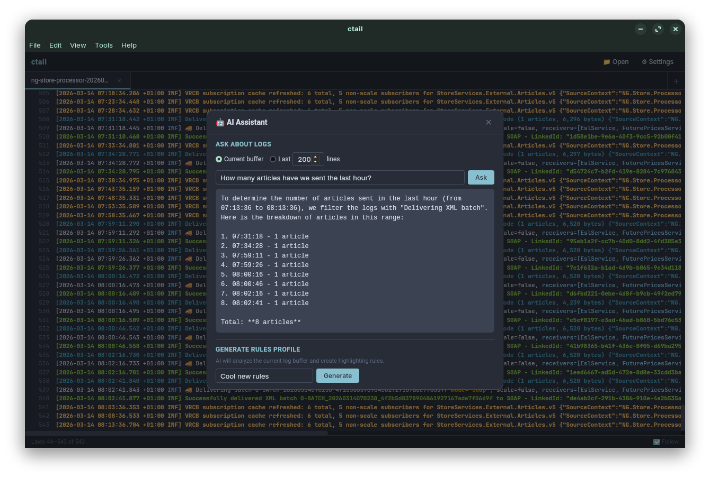
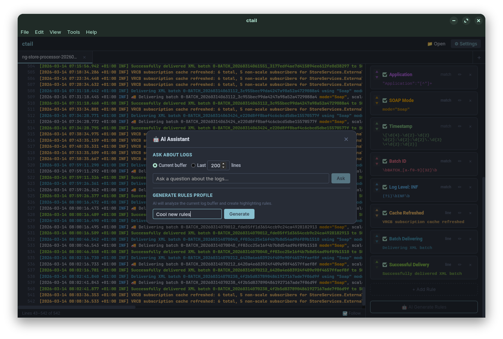

# AI Assistant Guide

ctail includes an optional AI assistant that can analyze log files and generate highlighting rule profiles. It supports multiple AI providers — you only need one.

## Table of Contents

- [Providers](#providers)
- [GitHub Copilot](#github-copilot)
- [GitHub Models](#github-models)
- [OpenAI](#openai)
- [Custom / Local (Ollama, LM Studio, etc.)](#custom--local)
- [Using the AI Assistant](#using-the-ai-assistant)
- [AI-Generated Rule Profiles](#ai-generated-rule-profiles)
- [Privacy & Data](#privacy--data)
- [Troubleshooting](#troubleshooting)

---

## Providers

| Provider | Auth Method | Endpoint | Notes |
|----------|-------------|----------|-------|
| **GitHub Copilot** | OAuth device flow (browser sign-in) | `api.githubcopilot.com` | Requires active [Copilot subscription](https://github.com/features/copilot) |
| **GitHub Models** | Personal Access Token (PAT) | `models.inference.ai.azure.com` | Free tier available with any GitHub account |
| **OpenAI** | API key | `api.openai.com` | Pay-per-use |
| **Custom** | API key (or none) | Any URL | Any OpenAI-compatible server (Ollama, LM Studio, vLLM, etc.) |

Configure your provider in **Settings → AI**.

---

## GitHub Copilot

The simplest option if you already have a Copilot subscription (Pro, Pro+, Business, or Enterprise).

### Setup

1. Open **Settings → AI**.
2. Select **GitHub Copilot** from the provider dropdown.
3. Click **Sign in with GitHub**.
4. A browser window opens to `github.com/login/device`. Enter the code shown in ctail (use the 📋 button to copy it).
5. Authorize the application on GitHub.
6. ctail detects the authorization automatically — you'll see "✓ Connected to Copilot".

### How It Works

- Uses the standard OAuth device flow with the same client ID as other Copilot integrations.
- Your GitHub OAuth token is stored locally in `settings.json`.
- Each AI request exchanges the token for a short-lived Copilot API token behind the scenes.
- Default model: `gpt-4o`. You can change this in the Model field.

### Disconnecting

Click **Disconnect** in the AI settings to remove the stored token.

---

## GitHub Models

Use GitHub's Models API with a Personal Access Token. Good if you don't have a Copilot subscription but have a GitHub account.

### Setup

1. Create a [fine-grained PAT](https://github.com/settings/tokens?type=beta) with the `models:read` permission.
2. Open **Settings → AI**.
3. Select **GitHub Models (PAT)**.
4. Paste your token.

### Notes

- Default model: `gpt-4o-mini`.
- Endpoint: `https://models.inference.ai.azure.com` (no need to change).
- Supports all models available on [GitHub Models](https://github.com/marketplace/models), including GPT-4o, GPT-4o-mini, and others.

---

## OpenAI

Use your own OpenAI API key for direct access.

### Setup

1. Get an API key from [platform.openai.com](https://platform.openai.com/api-keys).
2. Open **Settings → AI**.
3. Select **OpenAI**.
4. Enter the endpoint (default: `https://api.openai.com`) and your API key.

### Notes

- Default model: `gpt-4o-mini`.
- Any OpenAI model name works (e.g., `gpt-4o`, `gpt-4-turbo`, `o1-mini`).
- Pay-per-use based on your OpenAI account.

---

## Custom / Local

Connect to any OpenAI-compatible API server. This includes:

- **[Ollama](https://ollama.ai/)** — Run models locally, free. Endpoint: `http://localhost:11434`
- **[LM Studio](https://lmstudio.ai/)** — Local GUI + server. Endpoint: `http://localhost:1234`
- **vLLM, LocalAI, text-generation-webui** — Self-hosted servers
- **Any cloud provider** with an OpenAI-compatible API

### Setup

1. Open **Settings → AI**.
2. Select **Custom (OpenAI-compatible)**.
3. Enter the **endpoint URL** (e.g., `http://localhost:11434`).
4. Enter an **API key** if required (leave empty for local servers that don't require one).
5. Enter the **model name** (e.g., `llama3.2`, `mistral`, `codestral`).

### Notes

- ctail appends `/v1/chat/completions` to the endpoint automatically.
- For Ollama, make sure the model is pulled first: `ollama pull llama3.2`

---

## Using the AI Assistant

| Ask AI about Logs | AI-Generated Rules |
|:---:|:---:|
|  |  |

### Opening the AI Dialog

- **Menu bar**: Tools → AI Assistant... (**Ctrl+Shift+A**)
- **Context menu**: Right-click in the log view → "🤖 Ask AI about logs"

### Asking Questions

The AI assistant can analyze your log files. When asking a question, you choose what context to send:

| Context | What's Sent |
|---------|-------------|
| **Last N lines** | The most recent N lines from the active tab |
| **Selected text** | Only the text you've selected in the log view |
| **Full file** | The entire file content (limited by the scroll buffer) |

Type your question (e.g., "What errors are in this log?" or "Explain the stack trace") and press **Ask**.

### Tips

- Be specific: "What caused the NullPointerException at line 4523?" works better than "What's wrong?"
- The AI sees the raw log text — it doesn't know about your highlighting rules.
- Responses appear in the dialog and can be copied.

---

## AI-Generated Rule Profiles

The AI can analyze your log files and create a complete highlighting rule profile automatically.

### How to Generate

1. Open a log file that represents the format you want to highlight.
2. Open **Settings → Rules**.
3. Click **🤖 AI Generate Rules** at the bottom of the rules section.
4. Enter a name for the new profile.
5. The AI analyzes the log content and creates rules for patterns it detects (errors, warnings, timestamps, IPs, URLs, etc.).

### What It Creates

The AI generates a complete profile with rules including:
- Pattern (regex)
- Match type (line or match)
- Foreground and background colors
- Bold/italic styles
- Priority ordering

The generated profile is saved and can be edited like any manually created profile.

---

## Privacy & Data

- **Log content is sent to the AI provider** when you explicitly ask a question or generate rules. No data is sent in the background or automatically.
- **GitHub Copilot / GitHub Models**: Data is processed under GitHub's [privacy terms](https://docs.github.com/en/site-policy/privacy-policies).
- **OpenAI**: Data is processed under OpenAI's [usage policies](https://openai.com/policies/usage-policies).
- **Custom / Local**: Data stays on your machine if using a local server (Ollama, LM Studio).
- **API keys and tokens** are stored locally in your `settings.json` file. They are never transmitted anywhere except to the configured AI endpoint.

---

## Troubleshooting

### "AI provider not configured"

Select a provider in Settings → AI and complete the setup.

### "AI API key not set"

Enter your API key or sign in (for Copilot).

### Copilot: "Waiting for authorization" hangs

- Make sure you completed the authorization on GitHub in your browser.
- If a previous auth attempt timed out, click **Sign in with GitHub** again — it cancels any stale session.
- Check that your Copilot subscription is active.

### Copilot: "signed in but Copilot access denied"

Your GitHub account doesn't have an active Copilot subscription, or your organization has restricted Copilot access.

### GitHub Models: 401 or 403 error

Your PAT may have expired or lack the `models:read` permission. Create a new token.

### Custom provider: connection refused

Make sure the server is running. For Ollama: `ollama serve`. For LM Studio: start the server in the app.

### AI response is empty or generic

Try providing more context (more lines) or be more specific in your question. Different models vary in quality.
